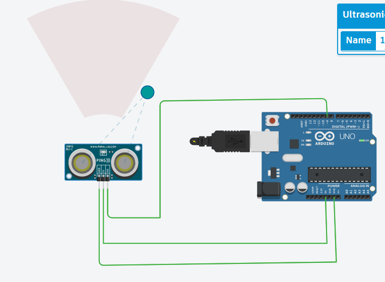
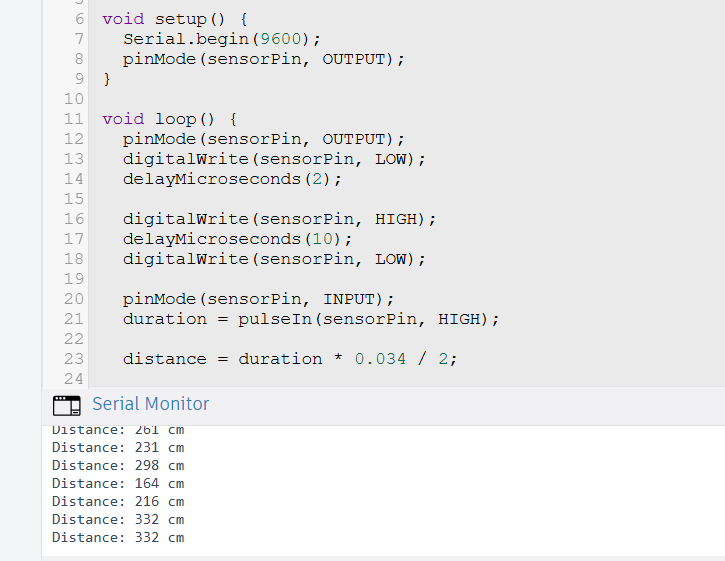

# 📏 Ultrasonic Distance Meter using Arduino

## 📌 Project Description
This project measures the distance of an object using an Ultrasonic Sensor and Arduino Uno.  
The measured distance is displayed in the Serial Monitor in centimeters.

The project was designed and simulated using Tinkercad.

---

## 🛠 Components Used
- Arduino Uno R3
- Ultrasonic Distance Sensor (3-pin)
- Jumper Wires
- Tinkercad Simulator 

---

## 🔌 Circuit Connections

| Sensor Pin | Arduino Pin |
|------------|------------|
| VCC        | 5V |
| GND        | GND |
| SIG        | Digital Pin 9 |

---

## 💻 Arduino Code

```cpp
#define sensorPin 9

long duration;
int distance;

void setup() {
  Serial.begin(9600);
}

void loop() {
  pinMode(sensorPin, OUTPUT);
  digitalWrite(sensorPin, LOW);
  delayMicroseconds(2);

  digitalWrite(sensorPin, HIGH);
  delayMicroseconds(10);
  digitalWrite(sensorPin, LOW);

  pinMode(sensorPin, INPUT);
  duration = pulseIn(sensorPin, HIGH);

  distance = duration * 0.034 / 2;

  Serial.print("Distance: ");
  Serial.print(distance);
  Serial.println(" cm");

  delay(1000);
}


## 🔌 Circuit Diagram





## 📊 Output 


